# HIMS VISUAL SOP FLOWCHARTS
## Diagram Alur Prosedur Operasional

**Version:** 1.0  
**Date:** December 5, 2025  
**Company:** PT Hanmarine Indonesia

---

## TABLE OF CONTENTS
1. [Crew Application Process](#1-crew-application-process)
2. [Contract Generation & Signing](#2-contract-generation--signing)
3. [Document Expiry Management](#3-document-expiry-management)
4. [Crew Replacement Process](#4-crew-replacement-process)
5. [External Compliance Management](#5-external-compliance-management)
6. [Monthly Compliance Reporting](#6-monthly-compliance-reporting)

---

## 1. CREW APPLICATION PROCESS

### Flowchart: SOP-001 Crew Application

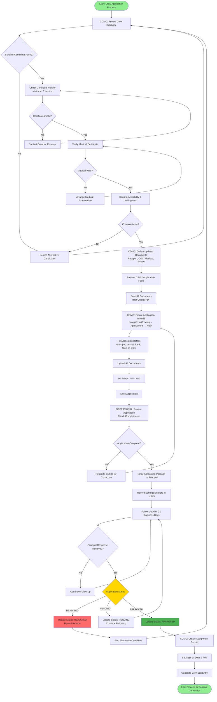

### Process Timeline
- **Day 1-2:** Crew selection and document preparation
- **Day 3:** Application creation in HIMS and submission to principal
- **Day 4-5:** Follow-up and principal response
- **Day 6:** Assignment creation (if approved)

### Key Decision Points
1. **Suitable Candidate?** - Search database for matching rank and availability
2. **Certificates Valid?** - Minimum 6 months validity required
3. **Medical Valid?** - Must be current and compliant
4. **Crew Available?** - Confirm willingness to join
5. **Principal Response** - APPROVED/REJECTED/PENDING

---

## 2. CONTRACT GENERATION & SIGNING

### Flowchart: SOP-002 Contract Execution

```mermaid
flowchart TD
    Start([Start: From Approved Assignment]) --> A[CDMO: Generate Contract<br/>Select Type: SEA or PKL]
    A --> B{Contract Type}
    B -->|SEA| C[SEA Contract:<br/>MLC Compliant Format<br/>For Onboard Compliance]
    B -->|PKL| D[PKL Contract:<br/>Indonesian Regulatory Format<br/>For Hubla Filing]
    C --> E[System Auto-populates Data<br/>Crew Info, Assignment, Wage Scale]
    D --> E
    E --> F[OPERATIONAL/ACCOUNTING:<br/>Review Contract Details]
    F --> G[Verify Wage Details vs Wage Scale]
    G --> H[Check Contract Duration & Terms]
    H --> I[Confirm Insurance Coverage]
    I --> J[Review Repatriation Terms]
    J --> K[Ensure Compliance with<br/>Principal Agreement]
    K --> L{Contract Accurate?}
    L -->|No| M[Return to CDMO for Correction]
    M --> E
    L -->|Yes| N[DIRECTOR: Final Review]
    N --> O{Director Approval?}
    O -->|No| P[Request Amendments]
    P --> E
    O -->|Yes| Q[Approve for Printing]
    Q --> R[Generate Final PDF]
    R --> S[ADMIN: Print Contract in Triplicate<br/>Original: Seafarer<br/>Copy 1: Company File<br/>Copy 2: Principal]
    S --> T[Arrange Signing Appointment<br/>with Seafarer]
    T --> U[Company Representative Signs]
    U --> V[Seafarer Signs]
    V --> W[Witness Signs if Required]
    W --> X[Date and Stamp Each Copy]
    X --> Y[CDMO: Scan Signed Contract]
    Y --> Z[Upload to HIMS]
    Z --> AA[Update Contract Status: ACTIVE]
    AA --> AB[File Physical Copy in Crew Folder]
    AB --> AC[Send Copy to Principal<br/>Email or Courier]
    AC --> AD{Contract Type Check}
    AD -->|PKL| AE[HR: Submit to Hubla Online System]
    AE --> AF[Obtain Registration Number]
    AF --> AG[Record Registration in HIMS]
    AG --> End([End: Contract Active])
    AD -->|SEA| End
    
    style Start fill:#90EE90
    style End fill:#90EE90
    style B fill:#FFD700
    style O fill:#FFD700
    style AD fill:#FFD700
```

### Contract Execution Timeline
- **Day 1:** Contract generation and review (CDMO, Operational, Accounting)
- **Day 2:** Director approval and printing
- **Day 2-3:** Signing appointment with seafarer
- **Day 3:** Upload to HIMS and file management
- **Day 4:** PKL submission to Hubla (if applicable)

### Contract Types
**SEA (Seafarer Employment Agreement)**
- MLC 2006 compliant
- Carried onboard vessel
- Contains employment terms, wages, working hours

**PKL (Perjanjian Kerja Laut)**
- Indonesian regulatory format
- Filed with Ministry of Transportation (Hubla)
- Required for immigration and work permit compliance

---

## 3. DOCUMENT EXPIRY MANAGEMENT

### Flowchart: SOP-003 Document Monitoring

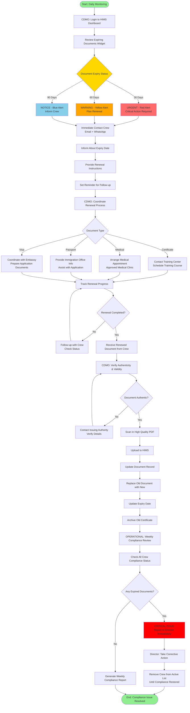

### Monitoring Schedule
- **Daily:** CDMO reviews expiring documents widget
- **Weekly:** OPERATIONAL reviews full compliance status
- **Monthly:** Generate comprehensive compliance report

### Alert Levels
- **90 Days (NOTICE - Blue):** First notification to crew
- **60 Days (WARNING - Yellow):** Plan renewal, coordinate appointments
- **30 Days (URGENT - Red):** Critical action, escalate to management

---

## 4. CREW REPLACEMENT PROCESS

### Flowchart: SOP-004 Crew Replacement

```mermaid
flowchart TD
    Start([Start: Last Week of Month]) --> A[OPERATIONAL: Generate Monthly Checklist]
    A --> B[Identify Contracts Expiring<br/>in Next 60 Days]
    B --> C[List All Positions Requiring Replacement]
    C --> D[Confirm Sign-off Dates with Principals]
    D --> E{Replacements Needed?}
    E -->|No| F[Monthly Review Complete<br/>No Action Required]
    F --> End([End: No Replacements])
    E -->|Yes| G[CDMO: For Each Expiring Position]
    G --> H[Search Database for<br/>Suitable Replacement Candidates]
    H --> I[Check Availability & Document Validity]
    I --> J[Create Shortlist<br/>2-3 Candidates per Position]
    J --> K[Discuss with Operational Manager]
    K --> L[Select Best Candidate]
    L --> M[Follow SOP-001:<br/>Crew Application Process]
    M --> N[Submit Replacement Application<br/>to Principal]
    N --> O[Request Approval<br/>Minimum 30 Days Before Sign-off]
    O --> P{Principal Approval?}
    P -->|Rejected| Q[Select Alternative Candidate<br/>from Shortlist]
    Q --> M
    P -->|Approved| R[CDMO: Create Assignment for Replacement]
    R --> S[Set Sign-on Date<br/>Usually Same as Sign-off Date]
    S --> T[Coordinate Joining Arrangements]
    
    T --> U[OPERATIONAL: Manage Sign-off Crew]
    U --> V[Arrange Transportation for Sign-off]
    V --> W[Coordinate with Vessel/Agent]
    W --> X[Prepare Sign-off Documents]
    X --> Y[Calculate Final Wages]
    
    T --> Z[CDMO: Manage Sign-on Crew]
    Z --> AA[Prepare Joining Documents<br/>Contract SEA & PKL]
    AA --> AB[Prepare Joining Instructions]
    AB --> AC[Arrange Travel Tickets]
    AC --> AD[Prepare Cash Advance if Applicable]
    AD --> AE[Brief Crew on Vessel Details]
    AE --> AF[Arrange Pre-departure Medical<br/>if Needed]
    
    Y --> AG[CDMO: Update Crew List in HIMS]
    AF --> AG
    AG --> AH[Mark Sign-off Crew: STANDBY]
    AH --> AI[Mark Sign-on Crew: ON_BOARD]
    AI --> AJ[Generate Updated Crew List Report]
    AJ --> AK[Send to Principal and Vessel]
    AK --> AL[ACCOUNTING: Contract Closure]
    AL --> AM[Close Contract for Sign-off Crew]
    AM --> AN[Calculate Final Settlement]
    AN --> AO[Process Payment]
    AO --> AP[Update Contract Status: COMPLETED]
    AP --> AQ{More Replacements?}
    AQ -->|Yes| G
    AQ -->|No| End2([End: All Replacements Complete])
    
    style Start fill:#90EE90
    style End fill:#90EE90
    style End2 fill:#90EE90
    style P fill:#FFD700
    style AQ fill:#FFD700
```

### Crew Replacement Timeline
- **Day 1-7 (Week 1):** Monthly checklist and replacement planning
- **Day 8-21 (Week 2-3):** Application process and principal approval
- **Day 22-30 (Week 4):** Joining arrangements and crew list update
- **Day 30-35:** Sign-off/sign-on execution
- **Day 36-40:** Contract closure and final settlement

### Critical Milestones
1. **60 Days Before:** Identify positions needing replacement
2. **30 Days Before:** Principal approval obtained
3. **14 Days Before:** Joining arrangements confirmed
4. **Sign-off Date:** Crew replacement executed
5. **7 Days After:** Final settlement completed

---

## 5. EXTERNAL COMPLIANCE MANAGEMENT

### Flowchart A: KOSMA Certificate Process

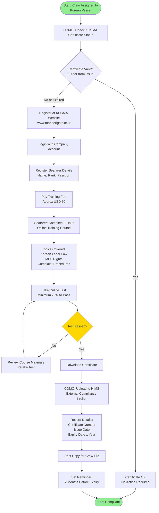

### Flowchart B: Dephub Certificate Verification

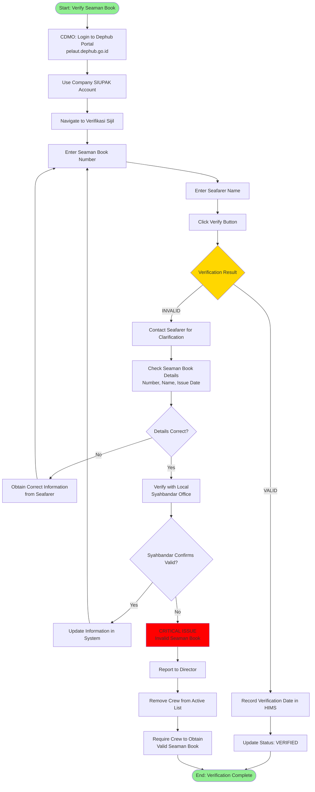

### Flowchart C: Schengen Visa Application

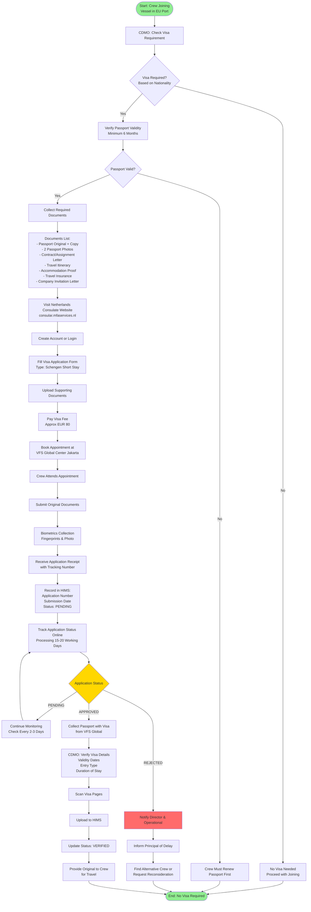

### External Compliance Systems Summary

| System | Purpose | Validity | Lead Time | Critical |
|--------|---------|----------|-----------|----------|
| **KOSMA** | Korean vessel training | 1 year | 2 months | Yes |
| **Dephub** | Seaman book verification | N/A (verify quarterly) | N/A | Yes |
| **Schengen Visa** | EU port joining | Per visa type | 2 months | Yes |

---

## 6. MONTHLY COMPLIANCE REPORTING

### Flowchart: SOP-006 Monthly Report Generation

```mermaid
flowchart TD
    Start([Start: Last Week of Month]) --> A[CDMO: Data Collection Phase]
    A --> B[Export Crew Database<br/>All Active, On Board, Standby]
    B --> C[Export Document Expiry Report<br/>30/60/90 Day Alerts]
    C --> D[Export Contract Status Report<br/>Active, Expiring, Expired]
    D --> E[Export Assignment Report<br/>Current Month Activity]
    E --> F[Export External Compliance Status<br/>KOSMA, Dephub, Visa]
    F --> G[OPERATIONAL: Analysis Phase]
    G --> H[Calculate Crew Statistics]
    H --> I[Total Crew by Status:<br/>- Active Count<br/>- On Board Count<br/>- Standby Count<br/>- Inactive Count]
    I --> J[Document Compliance Analysis]
    J --> K[Count Documents Expiring:<br/>- Next 30 Days URGENT<br/>- Next 60 Days WARNING<br/>- Next 90 Days NOTICE]
    K --> L[Contract Renewal Analysis]
    L --> M[List Contracts Expiring<br/>in Next 60 Days<br/>Replacement Plan Status]
    M --> N[Pending Applications Summary]
    N --> O[Count by Status:<br/>- PENDING Count<br/>- APPROVED Count<br/>- REJECTED Count]
    O --> P[External Compliance Status]
    P --> Q[KOSMA Certificates:<br/>- Valid Count<br/>- Expiring Soon Count<br/>Dephub Verifications:<br/>- Last Check Dates<br/>Visas:<br/>- Active Count<br/>- Pending Applications]
    Q --> R[OPERATIONAL: Report Generation]
    R --> S[Create Monthly Report Document<br/>Using Template]
    S --> T[Section 1: Executive Summary<br/>Key Metrics & Highlights<br/>Critical Issues Overview]
    T --> U[Section 2: Crew Statistics<br/>Total Crew by Status<br/>Month-over-Month Changes]
    U --> V[Section 3: Document Compliance<br/>Expiring Documents Table<br/>Renewal Progress]
    V --> W[Section 4: Contract Renewals<br/>Expiring Contracts List<br/>Replacement Status]
    W --> X[Section 5: Critical Issues<br/>Expired Documents<br/>Failed Applications<br/>Compliance Gaps]
    X --> Y[Section 6: Recommendations<br/>Action Items<br/>Process Improvements]
    Y --> Z[Section 7: Appendix<br/>Detailed Data Tables<br/>Supporting Charts]
    Z --> AA[Review Report for Accuracy]
    AA --> AB{Report Accurate?}
    AB -->|No| AC[Correct Errors]
    AC --> AA
    AB -->|Yes| AD[Add Management Commentary<br/>if Required]
    AD --> AE[Finalize Report PDF]
    AE --> AF[Submit to Director<br/>By 5th of Following Month]
    AF --> AG[Distribute to:<br/>- Director<br/>- CDMO<br/>- Accounting]
    AG --> AH[DIRECTOR: Management Review]
    AH --> AI[Review Monthly Report]
    AI --> AJ[Identify Trends & Issues]
    AJ --> AK{Critical Issues Found?}
    AK -->|Yes| AL[Provide Directives for<br/>Corrective Action]
    AL --> AM[Assign Responsibility & Deadline]
    AM --> AN[Track Corrective Actions]
    AN --> AO[Provide Feedback to Team]
    AO --> AP[Archive Report in Quality System]
    AP --> End([End: Report Completed])
    AK -->|No| AO
    
    style Start fill:#90EE90
    style End fill:#90EE90
    style AB fill:#FFD700
    style AK fill:#FFD700
```

### Monthly Report Timeline
- **Week 4 of Month:** Data collection (CDMO)
- **Day 1-3 of Next Month:** Analysis and report generation (OPERATIONAL)
- **Day 4:** Review and finalization
- **Day 5:** Submit to Director
- **Day 5-7:** Management review and feedback
- **Day 8:** Archive report

### Report Sections
1. **Executive Summary** - Key metrics, highlights, critical issues
2. **Crew Statistics** - Total crew by status, month-over-month changes
3. **Document Compliance** - Expiring documents, renewal progress
4. **Contract Renewals** - Expiring contracts, replacement status
5. **Critical Issues** - Expired documents, failed applications, gaps
6. **Recommendations** - Action items, process improvements
7. **Appendix** - Detailed data tables, supporting charts

### Key Metrics Tracked
- Total crew count by status
- Document expiry alerts (30/60/90 days)
- Contract expiry count (60 days)
- Application success rate
- External compliance status
- Critical issues count

---

## MODULE OVERVIEW DIAGRAM

### HIMS System Architecture

```mermaid
flowchart TB
    User([User Login]) --> Dashboard[Dashboard<br/>Role-Based View]
    
    Dashboard --> CrewModule[CREW MODULE]
    Dashboard --> ApplicationModule[APPLICATION MODULE]
    Dashboard --> AssignmentModule[ASSIGNMENT MODULE]
    Dashboard --> ContractModule[CONTRACT MODULE]
    Dashboard --> DocumentModule[DOCUMENT MODULE]
    Dashboard --> PrincipalModule[PRINCIPAL/VESSEL MODULE]
    Dashboard --> AccountingModule[ACCOUNTING MODULE]
    Dashboard --> HRModule[HR MODULE]
    Dashboard --> QualityModule[QUALITY/HGQS MODULE]
    Dashboard --> ComplianceModule[COMPLIANCE MODULE]
    
    CrewModule --> C1[Add/Edit Crew]
    CrewModule --> C2[Crew Status Management]
    CrewModule --> C3[Search & Filter]
    
    ApplicationModule --> A1[Create Application CR-02]
    ApplicationModule --> A2[Submit to Principal]
    ApplicationModule --> A3[Track Approval Status]
    
    AssignmentModule --> AS1[Create Assignment]
    AssignmentModule --> AS2[Sign-on/Sign-off Management]
    AssignmentModule --> AS3[Crew List Generation]
    
    ContractModule --> CO1[Generate SEA Contract]
    ContractModule --> CO2[Generate PKL Contract]
    ContractModule --> CO3[Contract Status Tracking]
    
    DocumentModule --> D1[Upload Documents]
    DocumentModule --> D2[Expiry Tracking]
    DocumentModule --> D3[Renewal Reminders]
    
    PrincipalModule --> P1[Principal Management]
    PrincipalModule --> P2[Vessel Management]
    PrincipalModule --> P3[Agency Agreement]
    
    AccountingModule --> AC1[Wage Scale Management]
    AccountingModule --> AC2[Agency Fees]
    AccountingModule --> AC3[Insurance Management]
    
    HRModule --> H1[Recruitment]
    HRModule --> H2[National Holidays]
    HRModule --> H3[Disciplinary Records]
    
    QualityModule --> Q1[Document Control]
    QualityModule --> Q2[Internal Audit]
    QualityModule --> Q3[Non-conformance Reports]
    
    ComplianceModule --> CM1[KOSMA Certificate]
    ComplianceModule --> CM2[Dephub Verification]
    ComplianceModule --> CM3[Schengen Visa]
    
    style Dashboard fill:#4CAF50,color:#fff
    style CrewModule fill:#2196F3,color:#fff
    style ApplicationModule fill:#2196F3,color:#fff
    style AssignmentModule fill:#2196F3,color:#fff
    style ContractModule fill:#2196F3,color:#fff
    style DocumentModule fill:#2196F3,color:#fff
    style PrincipalModule fill:#2196F3,color:#fff
    style AccountingModule fill:#2196F3,color:#fff
    style HRModule fill:#2196F3,color:#fff
    style QualityModule fill:#2196F3,color:#fff
    style ComplianceModule fill:#2196F3,color:#fff
```

---

## DATA FLOW DIAGRAM

### Complete Crewing Workflow

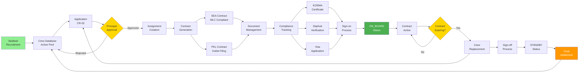

---

## PERMISSION MATRIX DIAGRAM

### Role-Based Access Control

```mermaid
flowchart TD
    System[HIMS System] --> Roles{User Roles}
    
    Roles --> R1[DIRECTOR<br/>Full Access]
    Roles --> R2[CDMO<br/>Crew & Documents]
    Roles --> R3[OPERATIONAL<br/>View Most/Edit Crewing]
    Roles --> R4[ACCOUNTING<br/>Financial Modules]
    Roles --> R5[HR<br/>Recruitment & HR]
    Roles --> R6[CREW_PORTAL<br/>Self-Service]
    Roles --> R7[AUDITOR<br/>Read-Only Compliance]
    
    R1 --> M1[All Modules<br/>FULL_ACCESS]
    
    R2 --> M2A[Crew: FULL]
    R2 --> M2B[Documents: FULL]
    R2 --> M2C[Applications: FULL]
    R2 --> M2D[Compliance: EDIT]
    
    R3 --> M3A[Crew: EDIT]
    R3 --> M3B[Applications: EDIT]
    R3 --> M3C[Assignments: EDIT]
    R3 --> M3D[Contracts: VIEW]
    
    R4 --> M4A[Contracts: FULL]
    R4 --> M4B[Wage Scales: FULL]
    R4 --> M4C[Agency Fees: FULL]
    R4 --> M4D[Insurance: FULL]
    
    R5 --> M5A[Recruitment: FULL]
    R5 --> M5B[HR: FULL]
    R5 --> M5C[Disciplinary: VIEW]
    R5 --> M5D[National Holidays: FULL]
    
    R6 --> M6A[Own Contracts: VIEW]
    R6 --> M6B[Own Documents: VIEW]
    R6 --> M6C[Own Assignments: VIEW]
    
    R7 --> M7A[Compliance: VIEW]
    R7 --> M7B[Quality: VIEW]
    R7 --> M7C[Documents: VIEW]
    
    style System fill:#4CAF50,color:#fff
    style Roles fill:#2196F3,color:#fff
    style R1 fill:#FF5722,color:#fff
    style R4 fill:#9C27B0,color:#fff
```

---

## NOTES ON DIAGRAM RENDERING

### How to View These Flowcharts

**Option 1: GitHub/GitLab**
- These Mermaid diagrams render automatically on GitHub and GitLab

**Option 2: VS Code**
- Install extension: "Markdown Preview Mermaid Support"
- Open this file and use Markdown preview

**Option 3: Online Tools**
- Visit: https://mermaid.live/
- Copy and paste diagram code
- Export as PNG/SVG/PDF

**Option 4: Documentation Tools**
- Use MkDocs with mermaid2 plugin
- Use Docusaurus with Mermaid support
- Use Confluence with Mermaid macro

### Diagram Legend

**Colors:**
- 🟢 Green: Start/End points, Positive outcomes
- 🔵 Blue: Process steps, Modules
- 🟡 Yellow: Decision points, Critical choices
- 🔴 Red: Critical issues, Errors, Rejections
- 🟠 Orange: Warnings, Important notices

**Shapes:**
- **Rectangle:** Process/Action step
- **Diamond:** Decision point
- **Rounded Rectangle:** Start/End point
- **Parallelogram:** Input/Output
- **Cylinder:** Database/Storage

---

**END OF FLOWCHARTS**

*These visual SOPs complement the written procedures in HIMS Complete Manual. For detailed step-by-step instructions, refer to Section 5 of the main manual.*
